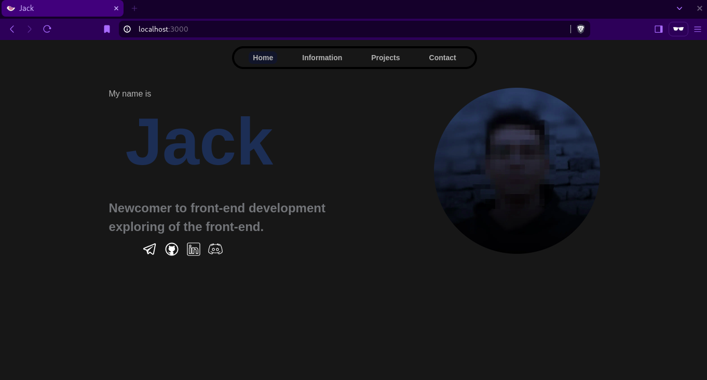
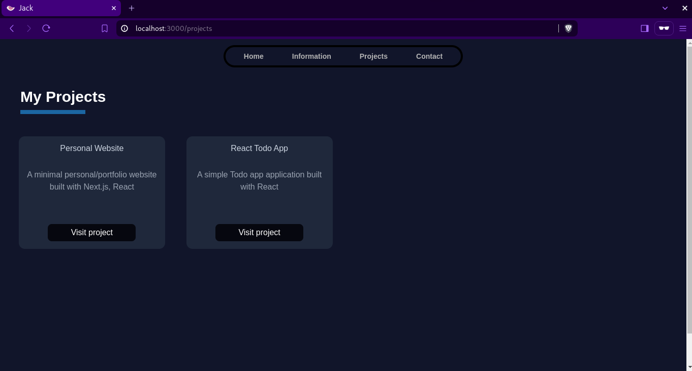
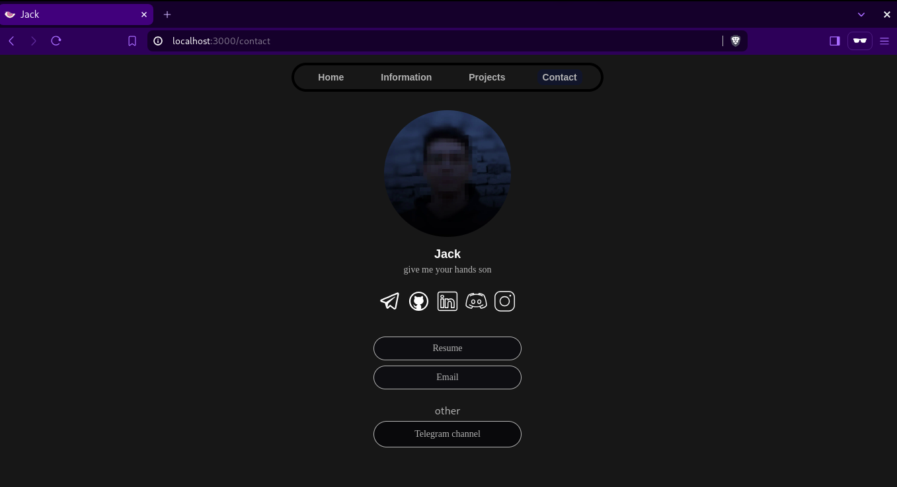

# Personal Portfolio Website

A minimal personal/portfolio website built with Next.js v14, React, TypeScript, and Tailwind CSS. This project is designed to showcase your skills, projects, and contact information in a sleek, modern interface.

## Preview



## Technology Used

- **TypeScript**: TypeScript is a superset of JavaScript that adds static typing, enhancing code quality and development experience by catching errors early and providing better tooling.
- **Next.js v14**: Next.js provides a powerful framework for building fast and efficient server-side rendered React applications, enabling features like static site generation and server-side rendering.
- **React**: React is a popular JavaScript library for building user interfaces, known for its component-based architecture and efficient rendering.
- **Tailwind CSS**: Tailwind CSS is a utility-first CSS framework that allows for rapid and flexible styling of components without leaving your HTML.

## Installation

Follow these steps to get a local copy up and running:

1. **Clone the Repository**: Clone this repository to your local machine using the following command:
    ```bash
    git clone https://github.com/j2a1ck/personal-website.git
    cd personal-website
    ```

2. **Install Dependencies**: Navigate to the project directory and install all necessary dependencies with:
    ```bash
    npm i
    ```

3. **Run the Development Server**: Start the development server using:
    ```bash
    npm run dev
    ```

4. **Open Your Browser**: Open your browser and visit:
    ```
    http://localhost:3000
    ```

## Screenshots

### Home Page


### Information Page


todo

### Projects Page




### Contact Page




## Customization

You can easily customize the website to fit your personal style and information. Here are some tips:

- **Update Content**: Modify the contents to reflect your personal information, projects, and contact details.

- **Add Components**: Create new components in the `/src/app/components` directory and use them across different pages to enhance functionality and layout.

## Contributing

Contributions are welcome! If you have any suggestions, find a bug, or want to add a new feature, please open an issue or submit a pull request. Follow these steps to contribute:

1. Fork the repository.
2. Create a new branch (`git checkout -b feature/YourFeature`).
3. Commit your changes (`git commit -m 'Add some feature'`).
4. Push to the branch (`git push origin feature/YourFeature`).
5. Open a pull request.

## License

feel free
